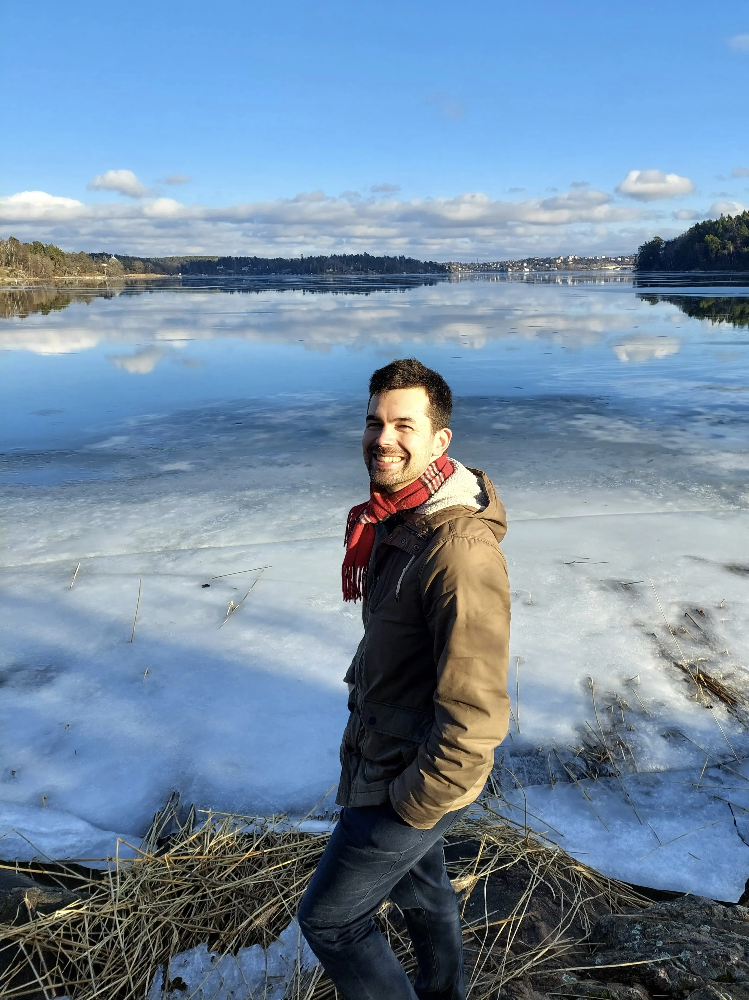

{style="width:50%;"}

I nuläget är jag ansvarig för ett **"datalabb"** på en myndighet under Finansdepartementet.

Jag har arbetat i Sverige sedan 2016, där jag har lett många projekt inom **civic tech, transparens genom öppna data och medborgardeltagande**.

Under 6 år var jag delägare av [Digidem Lab](https://digidemlab.org), ett ideellt kooperativ och en banbrytande organisation inom deltagande demokrati som organiserade Sveriges första medborgarråd och många andra deltagarprocesser (medborgarbudgetar...).

Parallellt har jag arbetat för att förbättra tillgången till data av allmänintresse i Sverige, särskilt inom områden som offentlig upphandling och lobbying i lagstiftningsprocessen. Genom nätverket [Civic Tech Sweden](https://civictech.se) organiserade jag många civic tech-träffar 2018-2021.

Detta ledde till att jag blev tjänsteman i oktober 2023 för att fortsätta kampen inifrån.
