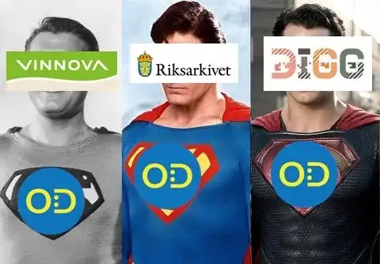
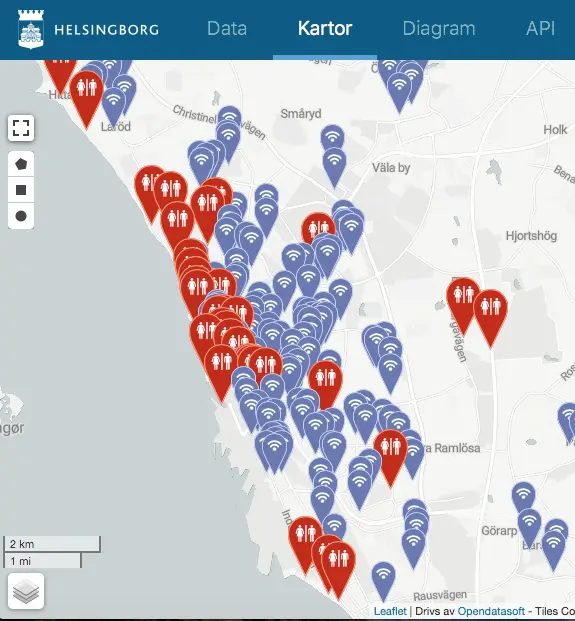
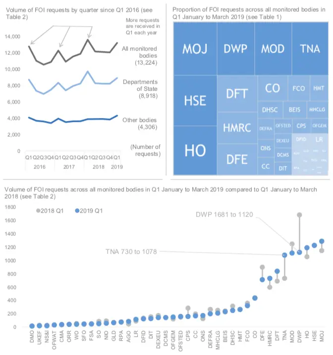
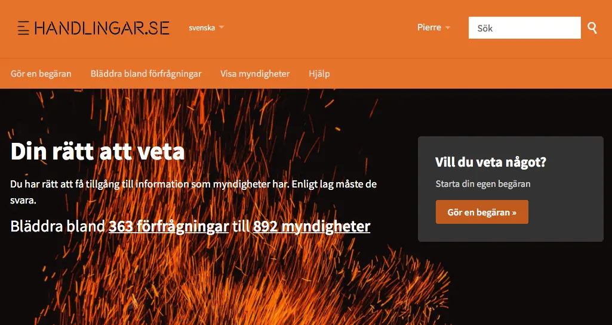
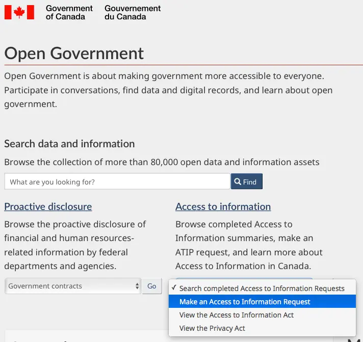
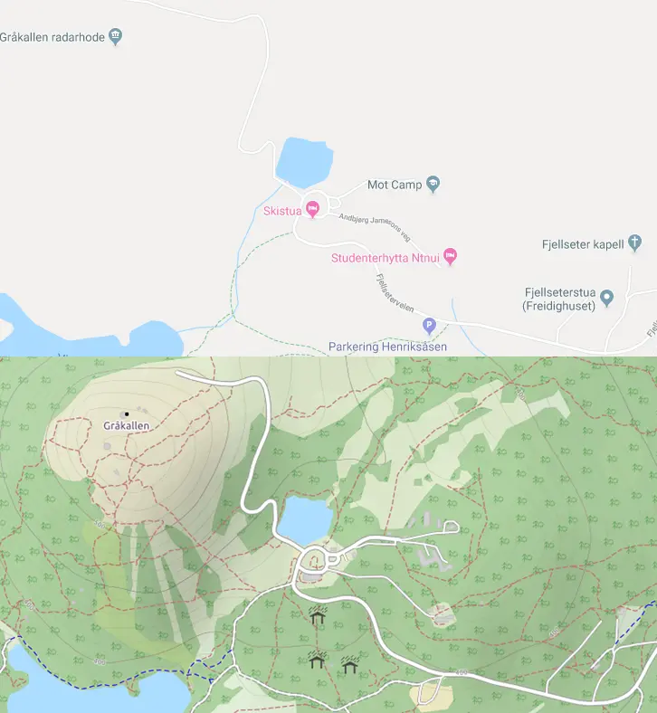

**THIS ARTICLE WAS ORIGINALLY RELEASED ON [MEDIUM](https://medium.com/civictechsweden/5-ideas-for-swedens-new-open-data-portal-d47beb65ec5f).**

A few weeks ago, I was in Sundsvall to discuss open data. I was invited by the newly formed open data team at DIGG (Sweden’s digitalisation agency) to help shape the new version of [oppnadata.se](http://oppnadata.se), Sweden’s open data portal.

The workshops went well and allowed us to express our needs and frustration as members of the small civic tech community in Sweden. I would even go as far as to express my hope as I saw a lot of new and motivated faces with what seems like a genuine interest in pushing for more openness in Sweden.

Not everyone seems to share my optimism. After seeing the government move open data around, from Vinnova to Riksarkivet and now DIGG, I’ve heard many wonder if this is actually the reboot they hope for. Time will tell if I was naive but I think most people will agree that Sweden can hardly lose three more years.

Unfortunately, I won’t be able to attend the last workshop. Civic Tech Sweden will be well represented by my friends Alessandro and Mattias but I thought I’d also put on paper some of the ideas that we got from these workshops so they can come to use, in Sweden or elsewhere. So here’s a list of five cool ideas for the future [oppnadata.se](http://oppnadata.se), with examples to illustrate! Read until the end, there’s a twist!

## User-friendly tools to manipulate the data

The Swedish open data portal is currently little more than a Wordpress website. It provides lists and a search engine to find the data you’re looking for but doesn’t help you further to visualise or process it.

Many countries and cities choose to lower the bar by providing interactive tools which make it simpler to display the data on a map or create basic graphs with it.

This is for example the case of the city of Helsingborg. Their portal, developed by OpenDataSoft, can display gorgeous maps with multiple datasets and let you share the visualisation you created or integrate it in another webpage.

These functions would be interesting in Sweden because the government has historically neglected one category of users even more than the others: citizens and civil society organisations. They are usually not data litterate but provide a lot of value to the society in many ways that could benefit from data.

## Leveraging on Freedom of information requests (Offentlighetsprincipsbegäran)

When it comes to open data, there’s a mantra you hear all the time in Sweden:

> Government: We need to listen to people’s needs!  
> Citizens: We’d like you to publish this dataset, can you do it?  
> Government: No, sorry, we prefer to release what people actually need!  
> Citizens: OK, here’s my need: this dataset. Can you please open it?  
> Government: Later, we first want to focus on people’s needs!  
> Citizens: …

The Swedish government has always been really selective in the needs it listens to. And even when they do listen, they can be really good at ignoring requests that they don’t wanna hear.

But theoretically, that makes sense, right? With limited resources, the government should prioritise the data to release.

What’s a **really good source of information** (the best, maybe) on which data people want?

> **Freedom of Information requests**
> (Offentlighetsprincipsbegäran in Swedish)

Every day, all public organisations receive requests for documents and information from citizens, journalists, businesses on all issues. We’re talking about hundreds of thousands of e-mails every year.

In the UK, all the requests that come to the central government and its agencies are analysed and they even publish [a quarterly report on it](https://www.gov.uk/government/statistics/freedom-of-information-statistics-january-to-march-2019). The USA have a website called [foia.gov](https://www.foia.gov) to help citizens send an FOI request which gathers valuable statistics. Both countries then use it to prioritise which datasets to release next.

In Sweden, Elenor Weijmar and Mattias Axell at Civic Tech Sweden deployed a platform called [handlingar.se](http://handlingar.se) (formerly Fråga staten) to do exactly that. You can use it to send a FOI request to any administration but the cool feature is that all the requests and their answer become public, enabling anyone to access the freed documents and any administration to keep track of what they get asked. There is even an API to automate the sending and fetching the data. Government bodies can also request documents and data from themselves and automate that process.

Now you maybe got what I’m getting at. What if the national open data portal enabled you with a few clicks and a simple form to request the data it doesn’t have to the relevant administration? What if the data was added to the list of available datasets as soon as the administration sends it back?

Better. What if DIGG used information about these requests and could send once in a while, the following message to other agencies:

> Dear government agency, we see that you received XXX requests this year regarding xxxxxx.
>
> According to our estimates, your collaborators spent a total of YY hours answering these requests.
>
> At DIGG, we would like to encourage you to release this data in a proactive way so you and the citizens who sent these requests can save a lot of time and effort. We remain available if you need help to do so.
>
> Best,
>
> DIGG

Well, I’m not making anything up. In addition to the UK and the USA, several other countries have adopted this approach.

Canada is a good example. On their [open portal homepage](http://open.canada.ca), a link to a form to request information stands in the middle. It checks that the data isn’t already freed, helps people to find which institution probably has it and automatically publishes the data on the portal when the request is fulfilled. Since 2017, more than 30 000 documents have been released this way.

By saving thousands of hours to the civil servants answering these requests, developing this function on the future open data portal would easily pay for itself 1000 times.

But there isn’t actually much to develop. Tools like [Handlingar](http://handlingar.se) (based on the open source solution [Alaveteli](http://alaveteli.org)) could easily be interfaced with the future portal. At Civic Tech Sweden, we are always open to collaborate.

## Creating a community around the data

This is a path followed by many open data portals around the world but let’s take a Swedish example.

[Trafiklab](http://trafiklab.se) is one of the cool kids of open data in Sweden. Thanks to Elias and his team, data for collective transportation is easily available and used in many services that people use daily.

On their website, a key feature is the *Projekt* tab, which shows all the registered services using the APIs. In many cases, people link to a Github repository with the code they wrote. In some, to the app that they built.

 using its APIs")

This achieves two goals: it helps data reusers to see how others have used it and it gives precious information to the data providers.

This logic is pushed even further on the main French national open data portal [data.gouv.fr](http://data.gouv.fr)

Anyone can add a “community resource” which can be the same dataset in another format or one with corrected data.
People can also link their reuses in a similar way to Trafiklab. Finally, there are social features to comment, like and follow a dataset, and discuss with the data providers.

")

Etalab, the French agency in charge of open data and open innovation, developed its own portal called **udata** to build these functionalities. As everything else they create, it is [open source](https://github.com/opendatateam/udata) and it is used by other countries like [Luxembourg](https://data.public.lu/en/) , [Portugal](https://dados.gov.pt/en/) or [Serbia](https://data.gov.rs/sr).

## One portal fits all?

DIGG has yet to build one good open data portal. But if we look a little further, few countries with a mature open data strategy satisfy themselves with a unique portal.

In France, Etalab opened 5 specialised portals for [addresses](https://adresse.data.gouv.fr), [transport](https://transport.data.gouv.fr), [geographic](https://geo.data.gouv.fr/fr/) and [corporate](https://entreprise.data.gouv.fr) data. And more are probably on their way.

In the Swedish context, where the effort has been considerably decentralised, that doesn’t mean that DIGG should start developing all these portals by itself. But it should try to coordinate the work done by Lantmäteriet for its [geodata portal](https://www.geodata.se/geodataportalen), Bolagsverket with its [APIs](https://bolagsverket.se/om/oss/api-1.11642) for corporate data and Trafiklab. Pushing them to open and reuse the same code would be a good start and would provide smaller agencies sitting on valuable data with tools to publish.

)")

Moreover, DIGG should also aim at releasing and gathering data from private providers, positioning itself as a broker. In many countries, ridesharing services and free floating companies are forced to publish open data to prevent a lock-in and improve competition. I will come back to this point in another article.

## Any portal at all?

If you’ve managed to read this post until the end, I hope you’re hyped by all of these international examples and want Sweden to have the shiniest portal of all!

**But what if I ended this article by saying that the portal doesn’t matter that much?**

Let’s look at the UK. Uncontested European champion of open data since the term has been coined, its government digital services successfully managed to release a huge amount of datasets while creating a vibrant ecosystem around it.

Its national portal? Little more than a list with a basic search engine.

 is a reference in minimalism")

What does that tell us? That building an advanced portal is not necessary.

**More importantly, that it’s not enough!**

DIGG needs much more than a shiny new open data portal to catch up with the rest of the crowd.

It first needs to push for the release of more data (like way more). When the data is not used, it needs to go beyond the data literacy barrier and help the administration develop its own services to help citizens and organisations access it.
These two points are often linked. In Canada, in France, in the UK, an agency rarely releases a new service without making the underlying data open with an API.

Finally, it should also help to push open data in services that people already use.

Take these last two examples: In 2014, the Norwegian agency Kartverket released most of its geographical data as open data. But they didn’t stop there. The data was [subsequently added to OpenStreetMap](https://wiki.openstreetmap.org/wiki/No:Kartverket_import) thanks to the help of volunteers. In 2015, I remember preferring it to Google Maps because the latter didn’t have any of the ski tracks.

In Sweden, some of the national museums understood early the importance of putting their data where the public is. In 2016, Nationalmuseet [released](https://www.nationalmuseum.se/en/nationalmuseum-releases-3-000-images-on-wikimedia-commons) thousands of high-resolution artwork on Wikimedia Commons, allowing the material to be reused on Wikipedia, but also in ads or memes.

_-_Nationalmuseum_-_117881.tiff) of the double-sided “Kneeling nun” (ca 1731) of Martin van Meytens")

Most of the reusers might never learn that the original art came from the museum, but that is not what mattered to Karin Glasemann (digital coordinator at Nationalmuseet) and her team. What they wanted was to introduce their collections to a much larger public. In 2018, [these artworks were used in over 1800 Wikipedia articles in more than 50 languages, and seen about 18 million times](https://www.slideshare.net/ssuser37e15b/frn-open-access-till-ppet-museum). Not bad at a time where the museum itself was closed to the public.

As Karin Glasemann puts it, opening the data is only the first step. What matters is what you do after that: enabling reuse, creating partnerships and building communities.

Let’s hope that the future Swedish open data portal helps us to achieve all of this!
