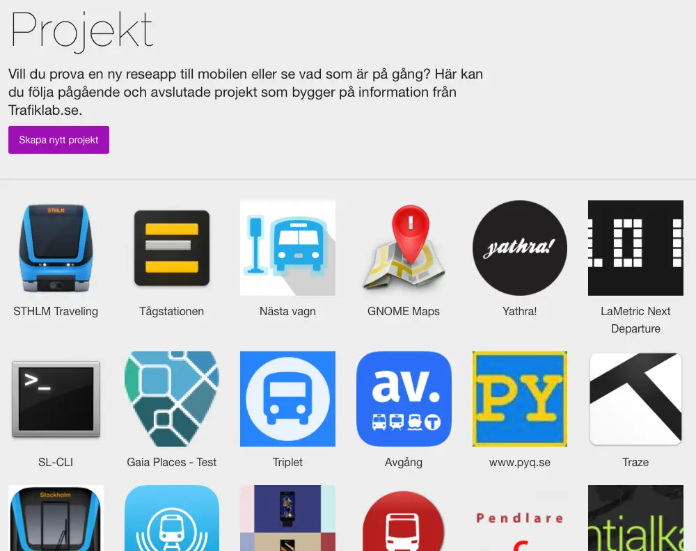

**DETTA INLÄGG PUBLICERADES URSPRUNGLIGEN PÅ [MEDIUM](https://medium.com/civictechsweden/5-ideas-for-swedens-new-open-data-portal-d47beb65ec5f) (PÅ ENGELSKA).**

För några veckor sedan var jag i Sundsvall för att diskutera öppna data. Jag var inbjuden av det nybildade öppna data-teamet på DIGG (Myndigheten för digital förvaltning) för att hjälpa till att forma den nya versionen av [oppnadata.se](http://oppnadata.se), Sveriges dataportal.

Workshopparna gick bra och lät oss uttrycka våra behov och vår frustration som medlemmar i den lilla civic tech-gemenskapen i Sverige. Jag skulle till och med sträcka mig så långt som att uttrycka mitt hopp då jag såg många nya och motiverade ansikten med vad som verkar vara ett genuint intresse för att driva på för mer öppenhet i Sverige.

Inte alla verkar dela min optimism. Efter att ha sett regeringen flytta runt ansvaret för öppna data, från Vinnova till Riksarkivet och nu DIGG, har jag hört många undra om detta faktiskt är den omstart de hoppas på. Tiden får utvisa om jag var naiv, men jag tror att de flesta håller med om att Sverige knappast har råd att förlora tre år till.

Tyvärr kommer jag inte att kunna delta i den sista workshoppen. Civic Tech Sweden kommer att vara väl representerade av mina vänner Alessandro och Mattias, men jag tänkte att jag också skulle skriva ner några av de idéer vi fick från dessa workshops så att de kan komma till användning, i Sverige eller någon annanstans. Så här är en lista på fem coola idéer för framtida [oppnadata.se](http://oppnadata.se), med exempel för att illustrera! Läs ända till slutet, det finns en twist!

## Användarvänliga verktyg för att manipulera data

Den svenska dataportalen är för närvarande lite mer än en Wordpress-webbplats. Den tillhandahåller listor och en sökmotor för att hitta den data du letar efter men hjälper dig inte vidare med att visualisera eller bearbeta den.

Många länder och städer väljer att sänka tröskeln genom att tillhandahålla interaktiva verktyg som gör det enklare att visa data på en karta eller skapa grundläggande diagram med den.

Detta är till exempel fallet med Helsingborgs stad. Deras portal, utvecklad av OpenDataSoft, kan visa snygga kartor med flera datamängder och låta dig dela visualiseringen du skapat eller integrera den på en annan webbsida.

Dessa funktioner skulle vara intressanta i Sverige eftersom regeringen historiskt sett har försummat en kategori av användare ännu mer än de andra: medborgare och civilsamhällesorganisationer. De är vanligtvis inte datakunniga men bidrar med mycket värde till samhället på många sätt som skulle kunna dra nytta av data.

## Utnyttja Offentlighetsprincipsbegäran (Freedom of Information requests)

När det gäller öppna data finns det ett mantra man hör hela tiden i Sverige:

> Myndighet: Vi måste lyssna på folks behov!  
> Medborgare: Vi skulle vilja att ni publicerar den här datamängden, kan ni göra det?  
> Myndighet: Nej, tyvärr, vi föredrar att släppa vad folk faktiskt behöver!  
> Medborgare: OK, här är mitt behov: den här datamängden. Kan ni snälla öppna den?  
> Myndighet: Senare, vi vill först fokusera på folks behov!  
> Medborgare: …

Den svenska regeringen har alltid varit väldigt selektiv med vilka behov den lyssnar på. Och även när de lyssnar kan de vara riktigt bra på att ignorera förfrågningar som de inte vill höra.

Men teoretiskt sett är det logiskt, eller hur? Med begränsade resurser bör regeringen prioritera vilken data som ska släppas.

Vad är en **riktigt bra informationskälla** (kanske den bästa) om vilken data folk vill ha?

> **Offentlighetsprincipsbegäran**
> (Freedom of Information requests på engelska)

Varje dag tar alla offentliga organisationer emot förfrågningar om handlingar och information från medborgare, journalister och företag i alla möjliga frågor. Vi pratar om hundratusentals e-postmeddelanden varje år.

I Storbritannien analyseras alla förfrågningar som kommer till regeringen och dess myndigheter, och de publicerar till och med [en kvartalsrapport om det](https://www.gov.uk/government/statistics/freedom-of-information-statistics-january-to-march-2019). USA har en webbplats som heter [foia.gov](https://www.foia.gov) för att hjälpa medborgare att skicka en FOI-begäran som samlar in värdefull statistik. Båda länderna använder sedan detta för att prioritera vilka datamängder som ska släppas härnäst.

I Sverige har Elenor Weijmar och Mattias Axell på Civic Tech Sweden lanserat en plattform som heter [handlingar.se](http://handlingar.se) (tidigare Fråga staten) för att göra exakt det. Du kan använda den för att skicka en begäran om allmän handling till vilken myndighet som helst, men den coola funktionen är att alla förfrågningar och deras svar blir offentliga, vilket gör att vem som helst kan komma åt de frigjorda handlingarna och vilken myndighet som helst kan hålla koll på vad de får för frågor. Det finns till och med ett API för att automatisera sändning och hämtning av data. Myndigheter kan också begära handlingar och data från sig själva och automatisera den processen.

Nu kanske du förstår vart jag vill komma. Tänk om den nationella öppna dataportalen gjorde det möjligt för dig att med några få klick och ett enkelt formulär begära den data den inte har från den relevanta myndigheten? Tänk om datan lades till i listan över tillgängliga datamängder så snart myndigheten skickar tillbaka den?

Bättre ändå. Tänk om DIGG använde information om dessa förfrågningar och då och då kunde skicka följande meddelande till andra myndigheter:

> Kära myndighet, vi ser att ni mottagit XXX förfrågningar i år gällande xxxxxx.
>
> Enligt våra uppskattningar har era medarbetare spenderat totalt YY timmar på att svara på dessa förfrågningar.
>
> På DIGG vill vi uppmuntra er att släppa denna data proaktivt så att ni och medborgarna som skickade dessa förfrågningar kan spara mycket tid och ansträngning. Vi finns tillgängliga om ni behöver hjälp med att göra detta.
>
> Vänliga hälsningar,
>
> DIGG

Nåväl, jag hittar inte på något. Förutom Storbritannien och USA har flera andra länder antagit detta tillvägagångssätt.

Kanada är ett bra exempel. På deras [öppna portals hemsida](http://open.canada.ca) finns en länk till ett formulär för att begära information mitt i blickfånget. Den kontrollerar att datan inte redan är frigjord, hjälper folk att hitta vilken institution som troligen har den och publicerar automatiskt datan på portalen när begäran är uppfylld. Sedan 2017 har mer än 30 000 dokument släppts på detta sätt.

Genom att spara tusentals timmar för tjänstemännen som svarar på dessa förfrågningar skulle utvecklingen av denna funktion på den framtida öppna dataportalen enkelt betala sig själv 1000 gånger om.

Men det finns faktiskt inte så mycket att utveckla. Verktyg som [Handlingar](http://handlingar.se) (baserat på open source-lösningen [Alaveteli](http://alaveteli.org)) skulle enkelt kunna gränssnittas med den framtida portalen. På Civic Tech Sweden är vi alltid öppna för samarbete.

## Skapa en gemenskap kring datan

Detta är en väg som följs av många öppna dataportaler runt om i världen, men låt oss ta ett svenskt exempel.

[Trafiklab](http://trafiklab.se) är en av de coola grabbarna inom öppna data i Sverige. Tack vare Elias och hans team är data för kollektivtrafik lättillgänglig och används i många tjänster som folk använder dagligen.

På deras webbplats är en nyckelfunktion fliken *Projekt*, som visar alla registrerade tjänster som använder API:erna. I många fall länkar folk till ett Github-repo med koden de skrivit. I vissa fall till appen som de byggt.

Detta uppnår två mål: det hjälper dataåteranvändare att se hur andra har använt den och det ger värdefull information till dataleverantörerna.

Denna logik drivs ännu längre på den franska nationella öppna dataportalen [data.gouv.fr](http://data.gouv.fr)

Vem som helst kan lägga till en "gemenskapsresurs" vilket kan vara samma datamängd i ett annat format eller en med korrigerad data.
Folk kan också länka sina återanvändningar på ett liknande sätt som Trafiklab. Slutligen finns det sociala funktioner för att kommentera, gilla och följa en datamängd, och diskutera med dataleverantörerna.

")

Etalab, den franska myndigheten ansvarig för öppna data och öppen innovation, utvecklade sin egen portal kallad **udata** för att bygga dessa funktioner. Som allt annat de skapar är den [open source](https://github.com/opendatateam/udata) och den används av andra länder som [Luxemburg](https://data.public.lu/en/) , [Portugal](https://dados.gov.pt/en/) eller [Serbien](https://data.gov.rs/sr).

## En portal för alla?

DIGG har ännu inte byggt en bra öppen dataportal. Men om vi tittar lite längre bort, nöjer sig få länder med en mogen strategi för öppna data med en enda portal.

I Frankrike öppnade Etalab 5 specialiserade portaler för [adresser](https://adresse.data.gouv.fr), [transport](https://transport.data.gouv.fr), [geografiska](https://geo.data.gouv.fr/fr/) och [företags](https://entreprise.data.gouv.fr)-data. Och fler är förmodligen på väg.

I det svenska sammanhanget, där ansträngningen har varit avsevärt decentraliserad, betyder det inte att DIGG bör börja utveckla alla dessa portaler på egen hand. Men de borde försöka samordna arbetet som görs av Lantmäteriet för deras [geodataportal](https://www.geodata.se/geodataportalen), Bolagsverket med deras [API:er](https://bolagsverket.se/om/oss/api-1.11642) för företagsdata och Trafiklab. Att pressa dem att öppna och återanvända samma kod skulle vara en bra början och skulle ge mindre myndigheter som sitter på värdefull data verktyg för att publicera.

)")

Dessutom bör DIGG också sikta på att släppa och samla in data från privata leverantörer, och positionera sig som en mäklare. I många länder tvingas samåkningstjänster och free floating-företag publicera öppna data för att förhindra inlåsning och förbättra konkurrensen. Jag kommer att återkomma till denna punkt i en annan artikel.

## Någon portal alls?

Om du har lyckats läsa detta inlägg ända till slutet, hoppas jag att du är peppad av alla dessa internationella exempel och vill att Sverige ska ha den glansigaste portalen av alla!

**Men tänk om jag avslutade den här artikeln med att säga att portalen inte spelar så stor roll?**

Låt oss titta på Storbritannien. Obestridd europeisk mästare på öppna data sedan begreppet myntades, deras statliga digitala tjänster lyckades framgångsrikt släppa en enorm mängd datamängder samtidigt som de skapade ett levande ekosystem runt det.

Deras nationella portal? Lite mer än en lista med en enkel sökmotor.

 är en referens i minimalism")

Vad säger det oss? Att bygga en avancerad portal inte är nödvändigt.

**Ännu viktigare, att det inte räcker!**

DIGG behöver mycket mer än en skinande ny öppen dataportal för att komma ikapp resten av gänget.

Först måste de driva på för att släppa mer data (typ mycket mer). När datan inte används måste de gå bortom barriären för datakunskap och hjälpa förvaltningen att utveckla sina egna tjänster för att hjälpa medborgare och organisationer att komma åt den.
Dessa två punkter hänger ofta ihop. I Kanada, i Frankrike, i Storbritannien släpper en myndighet sällan en ny tjänst utan att göra den underliggande datan öppen med ett API.

Slutligen bör de också hjälpa till att driva in öppna data i tjänster som folk redan använder.

Ta dessa två sista exempel: 2014 släppte den norska myndigheten Kartverket det mesta av sin geografiska data som öppna data. Men de stannade inte där. Datan [lades därefter till i OpenStreetMap](https://wiki.openstreetmap.org/wiki/No:Kartverket_import) tack vare hjälp från volontärer. 2015 minns jag att jag föredrog det framför Google Maps eftersom den senare inte hade några skidspår.

I Sverige förstod några av de nationella museerna tidigt vikten av att lägga sin data där allmänheten är. 2016 [släppte](https://www.nationalmuseum.se/en/nationalmuseum-releases-3-000-images-on-wikimedia-commons) Nationalmuseum tusentals högupplösta konstverk på Wikimedia Commons, vilket gjorde att materialet kunde återanvändas på Wikipedia, men också i annonser eller memes.

_-_Nationalmuseum_-_117881.tiff) av den dubbelsidiga 'Knäböjande nunna' (ca 1731) av Martin van Meytens")

De flesta återanvändare kanske aldrig lär sig att originalkonsten kom från museet, men det var inte det som spelade roll för Karin Glasemann (digital samordnare på Nationalmuseum) och hennes team. Vad de ville var att introducera sina samlingar för en mycket större publik. 2018 [användes dessa konstverk i över 1800 Wikipedia-artiklar på mer än 50 språk, och sågs cirka 18 miljoner gånger](https://www.slideshare.net/ssuser37e15b/frn-open-access-till-ppet-museum). Inte illa i en tid då själva museet var stängt för allmänheten.

Som Karin Glasemann uttrycker det, att öppna datan är bara det första steget. Vad som spelar roll är vad du gör efter det: möjliggöra återanvändning, skapa partnerskap och bygga gemenskaper.

Låt oss hoppas att den framtida svenska öppna dataportalen hjälper oss att uppnå allt detta!
