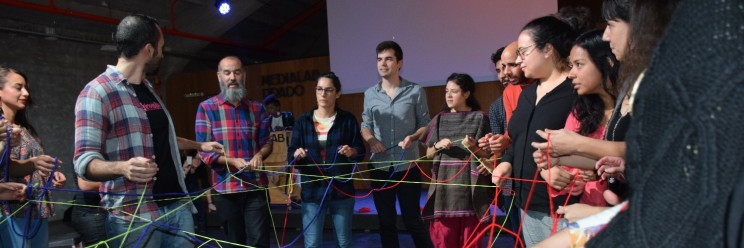

")

On May 24th, I turned 30. It was not a bitter celebration. On the contrary, I feel happier with each passing year and in many ways more secure in my life journey. Around the same time, I also celebrated 5 years as an official employee at Digidem Lab. I actually started a little earlier, but it was the funding we received from Vinnova for our Democratic Cities project that paid for my first salary in April 2018.

Digidem Lab was founded earlier in 2016 as a Heritage Fund project by Sanna Ghotbi, who had completely lost hope in our representative democracy after 4 years as the City of Gothenburg's youngest council member, Anna Sanne Göransson who had seen the need for more participation in Bergsjön after several years as a social worker, and Petter Joelson who realized already then how digitalization would affect our ways of organizing ourselves.

I had a slightly different entry point. Freshly graduated as an engineer, I wanted nothing more than to move abroad again after a successful semester in Norway and a few months in England. While looking for my dream job from my teenage room in the Paris suburbs, I spent my time at meetings and meetups in the then-blossoming civic tech community. It was a time when apps were invented every week to visualize the legislative process, collect petitions, or plan a political campaign. I was also deeply interested in the new wave of hackers entering the public sector to reform it with more openness and participation.

")

In 2015, the Law for a Digital Republic had been written on a digital platform with more than 100,000 contributions and introduced new principles into the law such as openness by default. Instead of requesting public documents, one could instead ask authorities to make them available online, preferably as open structured data. And all public organizations needed to immediately start opening everything that could be opened. As a logical consequence, France took the presidency of the Open Government Partnership and organized its *OGP Global Summit* the following year. Paris welcomed the world's openness activists and I started to feel that maybe this was something I wanted to use my powers for. At the same time, the capital's participatory budget returned with a pot of money worth over 1 billion SEK that Parisians could decide directly over. On every corner, there was a voting station or a pallet with individuals pitching their project.

")

Don't get me wrong, my homeland's democracy suffers from many flaws and that same autumn I was also at demonstrations against a labor market reform that the government would push through without a vote in parliament. Even today, these problems persist. But then the need for new ways to organize the state and redistribute power felt even more acute.

At the same time, I mostly wanted to go abroad and I was starting to get depressed looking for jobs from my old childhood home. I bought a ticket. It would be Stockholm in the end, and I would have to look for work and housing when I arrived.

Both were surprisingly easy to find, but I started almost simultaneously to look for the same things that had inspired me so much in France. Sweden and the rest of the Nordics were praised worldwide for their superior democracy, there was surely participatory budgeting in every village and deep involvement of citizens in all decisions that concerned them. Sweden was also the country that invented the principle of public access to official records (*offentlighetsprincipen*), the country where everyone's personal data was public online and where Mona Sahlin had to resign because of a chocolate bar, so I also expected open data everywhere and total transparency from public organizations.

I walked around different meetups in Stockholm, traveled to Visby during Almedalen Week, and knocked on many organizations' doors to understand where these innovations existed. I started meeting the enthusiasts pushing for them from the inside, but I also clearly noticed that much remained to be done.

")

And after about a year, I found Anna, Petter, and Sanna in the little ship that had recently started sailing: Digidem Lab. I barely realized then what adventures I was saying yes to when I came aboard.

As mentioned, I started with funding from Vinnova and our first project with Swedish municipalities. We had managed to find enthusiasts in both Gothenburg and Stockholm to try to test new ways of involving citizens.

")

Much of what we tested with them we imported from the various countries we studied. In Paris, we met many civil servants, politicians, activists, and citizens to understand how the city's participatory budget worked. On our blog, we wrote several posts that would, for example, lead several housing companies in Sweden to get started with the method with their tenants (the so-called tenant budgets). At Madrid's Medialab Prado, we met new democracy friends from all over the world and developed with them new analog and digital ways to influence. We imported open tools like CONSUL and Decidim which quickly started spreading in Sweden.

Pretty soon our small pilot projects grew and we needed to recruit new stars: Annie, Steph, David…

In parallel, we started the network Civic Tech Sweden with allied organizations and individuals in Sweden to organize meetups, hackathons, and easier find and support each other. We had the honor of inviting guests from many Swedish CSOs, journalists, authorities, but also activists from Taiwan, Canada, Estonia... 😊

")

In 2020 came the pandemic and our whole world collapsed. How would we organize participatory processes on the ground in Biskopsgården, Skärholmen, Helsingborg when all municipalities advised against physical meetings and the whole country moved to Zoom and Teams? We were not alone with that question and many organizations from all over the world started contacting us to solve these new challenges. We started working with New York City's democracy department, supporting participatory budgets in Chicago's vulnerable areas, and planning the EU's major Conference on the Future of Europe with the EU Commission.

")

All these projects were also occasions where we got the chance to collaborate with other wonderful democracy labs around the world. Even if we can sometimes feel a little alone in our industry in Sweden, there are siblings in every country that we could share experience and collaborate with: Open Source Politics and Missions Publiques in France, DBT and We do Democracy in Denmark, Deliberativa and Platoniq in Spain… Too many to mention them all. Everything we have learned we have received from them and I want to take the opportunity to thank for the endless support we have received. Because of that, it has always felt obvious that everything we create should be available to everyone. Knowledge, methods, code…

")

In 2022, we finally got the chance to work with a method that we had been trying to promote for over 5 years: citizens' juries. First with the City of Gothenburg's transition strategy, then with the Swedish Food Agency which hired us to conduct Sweden's first national citizens' panel. It was an incredibly educational year and I felt so grateful to be able to perform this assignment with such a great team!

")

I hope that this first attempt leads to many more citizens' panels in Sweden and I feel confident in Digidem Lab's capacity to continue supporting these future processes, to continue pushing the boundaries of what the word democracy means and to stand by the side of everyone trying to make our country and our world better. 😊

With increased polarization, an acute climate crisis, and a systemic dismantling of our welfare, Sweden needs more than ever to find new ways to come together and create a society for all.

For my part, a new chapter begins in October, where I hope to also be able to use my competence to influence. More about that coming soon.

I want to take the opportunity to thank everyone who has supported us, who has supported me during the last 5 years. And the biggest thanks to my brilliant colleagues! You are stars!
