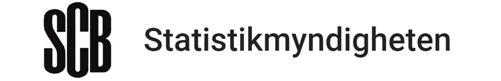
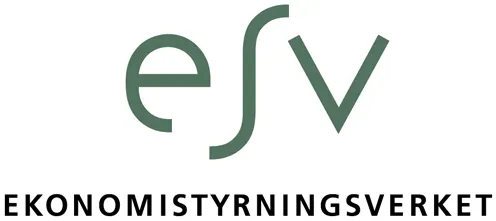
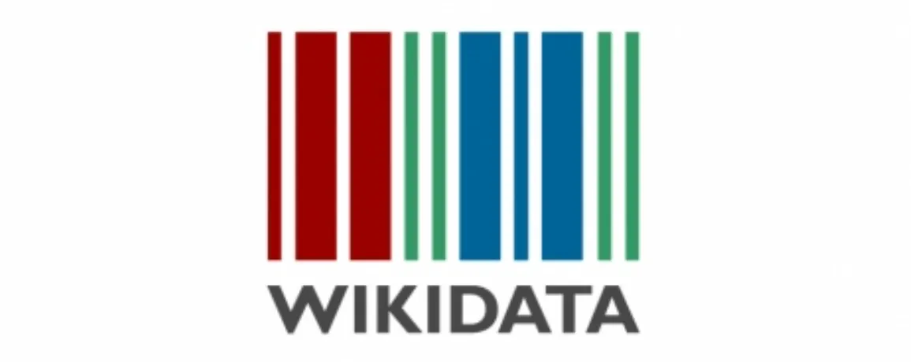

**THIS ARTICLE WAS ORIGINALLY RELEASED ON [MEDIUM](https://medium.com/civictechsweden/vem-har-koll-på-sveriges-myndigheter-dc8ca8e9dab7) (IN SWEDISH).**

A few weeks ago, the Swedish Agency for Public Management (Statskontoret) made a surprising announcement: they had found 25 new government agencies that no one seemed to know about.

)")

This anecdote echoes a problem I have wrestled with for several years in various projects. If you want to analyse what agencies say, what they do, or for example what they spend, you must first know who they are and what they are called. But every year new agencies are created and others are shut down. Some change names, others are merged.

An example I am working on right now in my role at the Swedish National Financial Management Authority's (ESV) datalab is a data analysis of agencies' consultation responses in a project funded by ESO. We fetch responses as PDFs from [regeringen.se](http://regeringen.se/), but this dataset also contains responses from municipalities, civil society, industry organisations, and even agencies that have changed names or ceased to exist. So how do we find the agencies' responses in these 40,000+ documents?

My naive guess when I tried many years ago was that it would be as easy as downloading the agency register (*myndighetsregister*) from Statistics Sweden (SCB) and matching against these names. But it's not that simple. Here are some examples of problems you encounter:

* the name "Jordbruksverket" gets no hits in the register (the agency is officially called Statens jordbruksverk)
* The Data Inspection Board (Datainspektionen) recently became the Authority for Privacy Protection (Integritetsskyddsmyndigheten), but SCB's register only contains current names
* Many organisations' names contain typos, both in our dataset and in the agency registers.

In addition to this, SCB's agency register is neither complete nor updated. So when I read the article, I wasn't surprised, but it made me want to learn more about the problem and develop a solution that would make the situation better.

## Where do you find information about agencies?

We start with a mapping of the so-called agency registers and other lists that exist. Here are the ones I found:

* SCB's [agency register](https://myndighetsregistret.scb.se/)
* Statskontoret's [Facts about the public administration](https://www.statskontoret.se/fokusomraden/fakta-om-statsforvaltningen/myndigheterna-under-regeringen/)
* ESV's [register](https://www.esv.se/rapportering/myndighetsregistret/) of agencies included in the state's accounting system and the [list](https://www.esv.se/statsliggaren/) of agencies that have received an appropriation direction
* The Swedish Agency for Government Employers' [member list](https://www.arbetsgivarverket.se/statistik-och-analys/staten-i-siffror-anstallda-i-staten/staten-i-siffror-om-arbetsgivarverkets-medlemmar/) (*Arbetsgivarverket*)
* [The Legal Database](https://beta.rkrattsbaser.gov.se/) which contains the agencies' instructions
* Wikipedia and its little sibling [Wikidata](https://www.wikidata.org/)
* [Handlingar.se](http://handlingar.se/), an important service that lists organisations covered by the principle of public access to official records, including government agencies

All of these have their own goal for mapping the state administration and their own perspective on the problem. But what happens if you fetch data from all these sources and merge them? The potential benefit is great:

* Analyse agencies in a smarter way based on the data mapped by different organisations
* Integrate this data into more systems thanks to a standardised machine-readable format
* Identify agencies based on their various names and abbreviations
* Detect errors in the original sources to ensure quality increases and the different registers become more consistent

## Myndighetsdata, everything in one place

That is why I started the project [Myndighetsdata](https://github.com/civictechsweden/myndighetsdata): key information about agencies in one place. The dataset contains information from all the lists above, including extinct agencies, old and alternative names, and attempts to merge the information in an automated way.


Here is an example with data for the Swedish National Financial Management Authority merged:

```json
{
  "name": "Ekonomistyrningsverket",
  "name_en": "National Financial Management Authority",
  "short_name": "ESV",
  "department": "Finansdepartementet",
  "org_nr": "202100-5026",
  "website": "www.esv.se",
  "phone": "086904300",
  "email": "registrator@esv.se",
  "cofog": 112,
  "cofog10": 1,
  "structure": "Enrådighet",
  "has_gd": true,
  "postal_address": "BOX 45316 104 30 STOCKHOLM",
  "office_address": "DROTTNINGGATAN 89 113 60 STOCKHOLM",
  "other_names": ["Potential other names..."],
  "sfs": [ "1998:417", ..., "2016:1023"],
  "wikidata": "Q7654780",
  "wikipedia": "https://sv.wikipedia.org/wiki/Ekonomistyrningsverket",
  "start": "1998-01-01",
  "employees": { "2024": 159, "2023": 136... },
  "women": { "2023": 95, "2022": 94... },
  "men": { "2023": 64, "2022": 63... },
}
```

You can access the project here on [Github](https://github.com/civictechsweden/myndighetsdata). The data contains machine-readable versions of all sources with standardised names for most fields, enabling comparisons and analysis. There is also a merged list that matches the same agencies across all registers where they appear, but it cannot be considered correct until it has been manually reviewed. As I explain further down, the data is too dirty to be fully classified automatically. The project's source code is of course open and can be reused to fetch data directly from the various sources.

Ultimately, my goal is not to create yet another list but to be able to compare, merge existing ones, and put the information on Wikidata so it can be used even more as a reliable source.

Below I report in more detail what I learned from each source and the various shortcomings I discovered. This may be important for understanding what can be created with the data.

### Notes on the different sources

#### SCB's agency register



Since 2007 ([SFS 2007:755](https://www.riksdagen.se/sv/dokument-och-lagar/dokument/svensk-forfattningssamling/forordning-2007755-om-det-allmanna_sfs-2007-755/)), Statistics Sweden (SCB) has been tasked with maintaining an agency register with basic information. As the ordinance states, the register should contain courts, public enterprises, and foreign agencies (embassies and delegations at international organisations) but not committees or special investigators. Since it was written in 2007, there was only an instruction to make the register "available to the public through a public website".

It is a bit unclear why SCB, one of Sweden's largest and best agencies for open data, which pumps out high-quality statistics every year, has chosen to fulfil the assignment at such a minimum level. The best example is that many agency names are written in UPPERCASE. Several administrative agencies and boards found in other lists are also missing, but it is unclear if SCB has chosen not to include them or just forgotten them. The quality varies between the different categories, which indirectly shows that some must be updated more manually than others.

Worst are the foreign agencies where I guess the information comes from the Ministry for Foreign Affairs (UD), when it comes. Some examples: "Svergies ambassad Santigao", "Sveriges Ambassad Nur-Sultan" (Kazakhstan's capital is now named [Astana](https://en.wikipedia.org/wiki/Astana) again) but also Sweden's representation to the OSCE or the Swedish Dialogue Institute for the Middle East and North Africa which seem to have been completely forgotten (aren't they agencies?). The safest source is then UD's website, but they do not publish a list, only information pages for Swedes abroad. SCB also publishes a file with parliamentary agencies (which was not requested in the ordinance) but it is unclear why it only includes 1 of the [9-10 boards](https://www.riksdagen.se/sv/kontakt-och-besok/riksdagens-myndigheter-och-namnder/) that the Riksdag lists on its website.

Besides quality, it is also surprising that SCB blocks you if you download too many files. It becomes difficult to build a data infrastructure on top of it, and there is little reason to limit the download of 6 static files from a technical perspective. On the website, SCB also publishes [a list](https://myndighetsregistret.scb.se/Ar) of closed and new agencies for each year since 2008. Unfortunately not as a structured list, so I have to [scrape](https://en.wikipedia.org/wiki/Web_scraping) and clean it before merging it with the register.

#### Statskontoret's Fakta om statsförvaltningen


Statskontoret is tasked with following and describing the development of the public sector and publishes a list of agencies in an Excel file in connection with its qualitative reports. It is undoubtedly the most reliable source, not least because the agency receives targeted assignments that complement the overall picture of state administration. It was during an assignment to map board authorities that 25 small boards were found and added to the list. Statskontoret is also very keen to define what they consider to be an agency and what is included in their mapping: foreign representation and parliamentary agencies are excluded, as well as temporary ones.

The list contains many details that must have been collected manually, such as alternative names, abbreviations, and management form, and it is so complete and detailed that it could be likened to a work of art. The disadvantage of manual collection, however, is that it becomes difficult to keep it fully updated and error-free. Some minor problems I could detect are [a court that changed names in 2022](https://www.domstol.se/nyheter/2022/11/hudiksvalls-tingsratt-blir-halsinglands-tingsratt2/) and [an agency that did so in 1977](https://sv.wikipedia.org/wiki/Universitetskanslers%C3%A4mbetet#Myndighetens_f%C3%B6reg%C3%A5ngare) (Statskontoret still uses the old spelling without "s"). A bigger problem is that the list has no ambition to be a register and that the data is not produced to be machine-readable. The file has no permanent URL, a trick must be used to automate the download. The format and Excel formulas in some cells make it difficult to extract the information. In some fields, comments occur instead of values.

#### The Swedish National Financial Management Authority (ESV)



ESV (Note: my current employer, but this post is not endorsed by the agency) has a fairly good grasp of Sweden's agencies for various reasons:

* ESV manages the state's accounting system (HERMES) where a larger part of the agencies report in,
* ESV collects the agencies' annual reports,
* ESV manages the IT system Statsliggaren where the Government Offices produce the agencies' *regleringsbrev* (steering letters).

It may seem confusing, but these three sources do not yield the same lists of agencies. From the first, ESV's agency register is created, but it is not complete because many agencies do not report in the state's accounting system. Nor does every agency have an annual report or receive an *regleringsbrev*; the smallest only have an instruction (*instruktion*).

Despite this, ESV is an interesting source because the agency publishes a lot of historical data, in some cases dating back to 1999.

Regarding data quality, there is not much to say. Some fields contain strange data such as "?" and since the agencies themselves enter their information in the system, several have forgotten to keep them updated (e.g. [PRV changed English name in 2020](https://www.altinget.se/nyttomnamn/0-myndighet-byter-namn) but has the old name left in HERMES). The last two lists must be scraped from the website while the first is available as a spreadsheet.

#### The Swedish Agency for Government Employers


The Swedish Agency for Government Employers is the state's employer organisation and an agency in itself. They manage a list of their members which both lacks certain agencies and includes other organisations. Despite this, they are an important source for HR statistics. Their open data is unfortunately very limited, but it is possible to download a list of members since 1980, which includes many agencies that no longer exist. Since some members are not agencies (e.g. the Church of Sweden (*Svenska kyrkan*) which was a member before 2000), they must be manually removed from the list. Format-wise, they have chosen to offer their statistics using Tableau to visualize them. This makes it impossible to automatically download data and the file is not entirely easy to convert to structured data.

#### The Government Offices' code of statutes


Not per se a list of agencies but perhaps the most important source because it contains all agencies' instructions. Not all agencies have a *regleringsbrev* or an annual report, but basically everyone has an instruction. The vast majority of instructions have a very clear name "Förordning med instruktion för XXX" or "Lag med instruktion för YYY" for parliamentary agencies, which makes it very easy to find the vast majority of agencies ever since the 1960s. Unfortunately, some agencies share an instruction so it is not possible, for example, to know how many [local safety boards at nuclear facilities](https://beta.rkrattsbaser.gov.se/sfs/item?bet=2007%3A1054) there are without linking it to another source (like Statskontoret's list).

Otherwise, the database is of very high quality, with a few exceptions ([Formum för levande historia](https://beta.rkrattsbaser.gov.se/sfs/item?bet=2002%3A795)), and the new beta website that the Government Offices have created has a very good API so it is possible to download the entire Swedish code of statutes very easily. The API is private and undocumented so it may not be enough to say that the Government Offices have completely started with open data, but it shows what a modern [regeringen.se](http://regeringen.se/) could look like in the future.

#### Wikipedia and Wikidata



Everyone probably knows Wikipedia, but fewer may have heard of its sibling project Wikidata. The database contains much of Wikipedia's information in a structured format (SPARQL), which makes it possible to fetch all agencies and a lot of metadata (if available). Thanks to the project's many volunteers and initiatives like [Govdirectory](https://www.wikidata.org/wiki/Wikidata:WikiProject_Govdirectory) and [Wikidata Riksdag](https://www.wikidata.org/wiki/Wikidata:WikiProject_Sweden/Swedish_Riksdag_documents), there are many Swedish agencies on Wikidata, and much more!

In the long run, I hope my little project allows us to gather even more information there and keep it updated.

**EDIT:** After I published this blog post, I used the data collected in the project to clean and complete hundreds of Wikidata items and Wikipedia pages. I hope it can help more people in the future.

#### Handlingar.se


Another unofficial source is [handlingar.se](http://handlingar.se/), an important initiative from Open Knowledge Sweden to modernise Sweden's freedom of information act (*offentlighetsprincipen*). It is a platform that makes it easy to request public documents, see public actors' responses, and publish what is released as open data. Elenor Weimar, Mattias Axell and others do a great job with this service, which is based on open source and exists in [many countries in the world](http://alaveteli.org/deployments/), and as part of this project, they release a list of organisations covered by the freedom of information act, which they publish as open data (CSV). The list contains more than just agencies, but it is possible to filter on certain categories.
