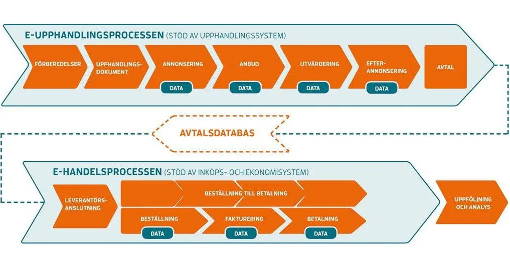

In Sweden, public procurement was estimated to be worth a staggering **683 billion crowns** in 2017[^fn:1]. Over 18000 tenders are launched each year by public institutions.
{.dropcap}

Public procurement is a crucial part of a working government and a fair and effective process has positive consequences on the whole society, freeing needed resources and leaving less room for corruption.

It also faces constant challenges due to the ever-changing nature of the services and goods that public institutions need to buy and to the constant trend of privatisation and subcontracting that most governments have been going through for the past 40 years.

---

In this article, we're going to look at the **state of public procurement in Sweden**, list some of the problems it's facing and compare it to other countries from the perspective of openness. Finally, we'll introduce a project we are starting at Civic Tech Sweden to address these issues and raise awareness among the relevant authorities. Ready?

## Data all over the place

Let's start with an obvious statement: **public procurement is a data-intensive process**. From tender ads to signed contracts and invoices, the whole chain is documented with care, ideally in a standardised digital form.

Almost all of this data is public sector information and as such, it can usually be obtained sending a FOIA request to the corresponding institution. To make the process smoother, the law sometimes requires to publish part of this information proactively. It bears a critical importance for all the parties involved:

* **journalists**, who make FOIA requests regularly, need this data to investigate corruption and wrongdoing, leading to a healthier public sector;
* **private companies** need to be informed about tenders in an easy and timely way to be able to bid. They also need as much insight as possible into past tenders to be able to optimise their offer in terms of price and service;
* **public institutions** need as many companies as possible responding to their tenders to foster fair competition, leading to lower prices and a higher service level. They also need analytics on how they are performing with their purchasing. A good way to do so is to compare themselves to institutions of similar nature and size;
* **citizens** benefit from all of this by getting better services for a lower price.

## The current situation in Sweden 🇸🇪

In Sweden, a continuous effort has been made to digitalise the whole process, the latest episode being the obligation for public institutions to be able to receive electronic invoices[^fn:2] (with the european standard PEPPOL BIS Billing 3[^fn:3]). Apart from a few exceptions, digital data is now the norm all along this chain, and **Sweden could even be considered one of the most advanced countries in that regard**.

One might think that data is used as much as it could be to provide the aforementioned benefits and match offer and demand in the best of all worlds. As our first investigations revealed, this is absolutely not the case and that is exactly why we are setting up our project.

Right now, the situation is along these lines:

* **journalists** have to send FOIA requests to access the documents they need. In practice, it’s a tedious and unnecessarily complex process, the documents are rarely provided in a standardised format, and it costs both the demander and the responder some unneeded time. The best case scenario here is e-mails and PDFs, Excel spreadsheets at best. Sometimes, it’s a lot of paper and remember that the Swedish FOI act allows public entities to shamelessly charge 2kr per page without justifying of a related cost…
* **private companies** have to pay for a private service to see and get alerts about the tenders that interest them. The market for these services (Upphandlingsmyndigheten provides a list) is small, almost a monopoly due to the lock-in of the data by the providers of the procurement software used by the institutions. Visma, the biggest of them, keeps a dominant position by circulating the data between its own services. It’s hard to measure how much **this cost deters small and medium companies from even considering public sector institutions as a potential buyer** but one could hardly deny that it probably reduces the competition.
* **public institutions** get really little insight in their buying behaviour, much less than we assumed in the first place. Some of it is sold by the providers of procurement software (Visma benefiting from its dominant position to provide better analytics) but in general, municipalities and government agencies have to resort to time-consuming audits and the smallest organisations do not have the resources for anything.

This is not to deny the fact that the procurement system in Sweden might be one of the most effective and least corrupted in the world. But the above should give you an idea of the **huge potential for improvement**.

## Do they do it differently elsewhere?

Spoiler: yes, they do.

In developed countries, a free public tender ad database is usually considered an essential piece of a fair and effective procurement system. According to research by Digiwhist and Open Knowledge Germany[^fn:4], almost all European countries (31 of 34) had one in 2017 (EDIT in 2022: Sweden is now the only one who doesn't have one). In Scandinavia, these services have cute names such as [udbud.dk](https://udbud.dk) in Denmark, [doffin.no](https://doffin.no) in Norway, [hilma.fi](https://www.hankintailmoitukset.fi/sv/) in Finland.

It’s plain logic: the more you restrict access to information about the tenders, the less competition you’ll have. A paywall is probably the most effective way to deter companies from trying to address your need as a government.

---

Many countries and municipalities have also started publishing open data for other steps of the process to improve transparency or efficiency.

The most famous case is Ukraine, where the platform **ProZorro** was created by the NGO Transparency International to monitor, streamline and open procurement, with great success[^fn:5].

)")

Maybe closer to Sweden, countries like Canada[^fn:6], the UK[^fn:7] and France[^fn:8], have taken on the task of publishing as much data as possible since the beginning of the 2010s.

Finland has gone furthest in the Nordics and publishes all the invoices of its government agencies as open data and on an interactive platform called [granskaupphandlingar.fi](https://granskaupphandlingar.fi). Earlier this year, the decision was also taken to add the documents of all local institutions.

## Fighting against the status quo

Why is Sweden hardly doing anything in the area?

Hard to tell but the situation doesn’t seem to improve. Recently, the government gave Upphandlingsmyndigheten the responsibility to gather statistical data about procurement and not once was the possibility of opening the raw data mentioned, even though their report was mentioning Finland as an example to follow[^fn:9]...

When asking an executive of the agency about it this Summer, we got this unfortunate answer:

> We have the offentlighetsprincip and this is something that very few countries in the world have. We should already be satisfied with it.

~~Incompetence~~ Ignorance is bliss.

---

In a country convinced of its superiority in a certain number of fields like transparency, the misconception that Sweden’s FOI act would be rare (most democracies in the world have one) or even superior (many countries have modernised theirs to adapt to the data era and take advantage of the benefits of open data, unlike Sweden) is not uncommon.

This explains that after asking all the relevant government agencies (Upphandlingsmyndigheten, Konkurrensverket, DIGG, SKL and its purchase company Kommentus), not a single one could point to an internal contact person working on opening this data…

A quick review of the local administrations found that only 3 municipalities have taken the initiative to open their invoices ([Göteborg](https://catalog.goteborg.se/catalog/6/datasets/75), [Örebro](https://www.orebro.se/fordjupning/fordjupning/fakta-statistik-priser--utmarkelser/information-tillganglig-for-ateranvandning/inkomna-leverantorsfakturor-reskontra--kontoklasser.html) and [Lidingö](https://lidingo.dataplattform.se/#/data/leverantorsfakturor)). This is always the result of pioneers who saw early the potential of releasing them, such as Kim Lantto or Björn Hagström who already wrote about it on his city blog in 2015[^fn:10]. These initiatives should be praised but they hardly show a positive trend and they can’t benefit from the potential of doing this on a bigger scale.

At this pace, one might expect SKL to catch up in 2050 and all the municipalities to release the data by 2070. This is not satisfactory!

## Our project

Civic Tech Sweden has thus decided to start something on this topic with the hope of:

* raising awareness!
* assessing what the possibilities are for opening this data and what some of the blocking points could be;
* writing guides and setting standards to help the public actors to release the data in a painless and effective way;
* prototyping a selection of services around the data to showcase the possibilities;
* eventually building an ecosystem for innovation around procurement data that benefits all involved actors and saves public money!

The project is currently called *Öppen Upphandling* for lack of a better name, feel free to suggest a catchier one!

Sounds exciting? Well what are you waiting for? Our goal is to get something started and everyone is welcome to join our efforts or build something on top of what we do, as long as you embrace the principles of open innovation and open data!

If you are a public institution, a private company or a journalist and you are interested in taking part in this project in one way or another, we are setting up a working group and are really interested to hear about your needs!
Contact us by [email](pierre@mesu.re) or directly on our [Matrix.org chat](https://app.element.io/#/room/#civictechsweden:matrix.org).

---

**UPDATE**: We received funding from Vinnova to run this project with Open Knowledge Sweden, DIGG and partners like FGJ and Transparency International Ukraine. The project is now called OpenUp! and has [its own website](https://openup.okfn.se).

**UPDATE 2025**: Unfortunately, our project has not led to the major changes we hoped for. I (Pierre) am still fighting in every possible way for open procurement data and you are more than welcome to contact me if you want to talk or collaborate on it. 🙂

## References

[^fn:1]: [Statistics from Konkurrensverket's 2018 report on public procurement (konkurrensverket.se)](https://www.konkurrensverket.se/globalassets/publikationer/rapporter/rapport_2018-9_statistikrapport_2018_webb.pdf)
[^fn:2]: [DIGG on compulsory e-invoice (Archived, digg.se)](https://web.archive.org/web/20200103195603/https://www.digg.se/nationella-digitala-tjanster/e-handel-och-e-faktura/obligatorisk-e-faktura-till-offentlig-sektor)
[^fn:3]: [SFTI on PEPPOL (sfti.se)](https://sfti.se/sfti/standarder/peppolbisehandel/peppolbisbilling3.49021.html)
[^fn:4]: [Recommendations for the Implementation of Open Public Procurement Data (Archived, opentender.eu)](https://web.archive.org/web/20220331045834/https://opentender.eu/blog/2017-03-recommendations-for-implementation/)
[^fn:5]: [From the fires of revolution, Ukraine is reinventing government (wired.com)](https://www.wired.com/story/ukraine-revolution-government-procurement/)
[^fn:6]: [Jaimie Boyd on transparency in Canadian procurement (medium.com)](https://jaimieboyd.medium.com/canadas-open-by-default-procurement-pilot-an-experiment-in-agility-e10c9acd5806)
[^fn:7]: [Improving and opening up procurement and contract data (gds.blog.gov.uk)](https://gds.blog.gov.uk/2015/11/19/improving-and-opening-up-procurement-and-contract-data/)
[^fn:8]: [Open Data Laws in France Increase Competition for Public Contracts (ogpstories.org)](https://www.ogpstories.org/open-data-laws-in-france-increase-competition-for-public-contracts/)
[^fn:9]: [Förberedande studie om vissa inköpsvärden (upphandlingsmyndigheten.se)](https://www.upphandlingsmyndigheten.se/kunskapsbank-for-offentliga-affarer/publikationer/slutrapport-vissa-inkopsvarden/)
[^fn:10]: [From paper archive to open data (Archived and in Swedish, blogg.orebro.se)](https://web.archive.org/web/20231206053715/https://blogg.orebro.se/enklarevardag/2015/09/10/fran-pappersarkiv-till-oppna-data/)
