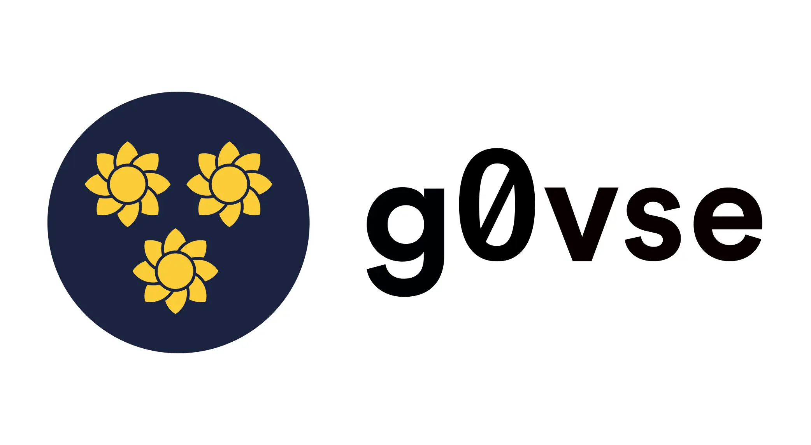


 g0v.se


 Källkod


 Data


Jag kom till Sverige 2016 och började snabbt bygga tjänster som baserades på myndighets- och lagstiftningsdata. Riksdagen publicerar öppna data om all sin verksamhet och produktion sedan 2010. Tyvärr styrs all regeringens verksamhet samt det förberedande lagstiftningsarbetet av Regeringskansliet, och de har väldigt lite intresse för öppna data, transparens och demokratisk innovation. De kämpar också generellt med sin egen digitalisering.

Jag vet det eftersom jag har träffat dem otaliga gånger och bett dem att förbättra situationen, utan framgång. Så jag försökte göra information från deras webbplats ([regeringen.se](https://www.regeringen.se)) mer tillgänglig genom projekt som Din Riksdag och OpenRemiss. Och med varje projekt fick jag en bättre förståelse för deras system och hur deras data är organiserad. På vägen stötte jag också på många journalister, forskare, företag och till och med myndigheter som brottades med samma problem.

Så 2024 bestämde jag mig för att samla all den kunskapen i g0vse, ett projekt som laddar ner all information från regeringens webbplats varje natt och tillgängliggör den som öppna data i ett format som folk faktiskt kan återanvända.

Du kan läsa mer (på svenska) på [g0v.se](https://g0v.se) och om de tekniska aspekterna (på engelska) på [Github](https://github.com/civictechsweden/g0vse).
