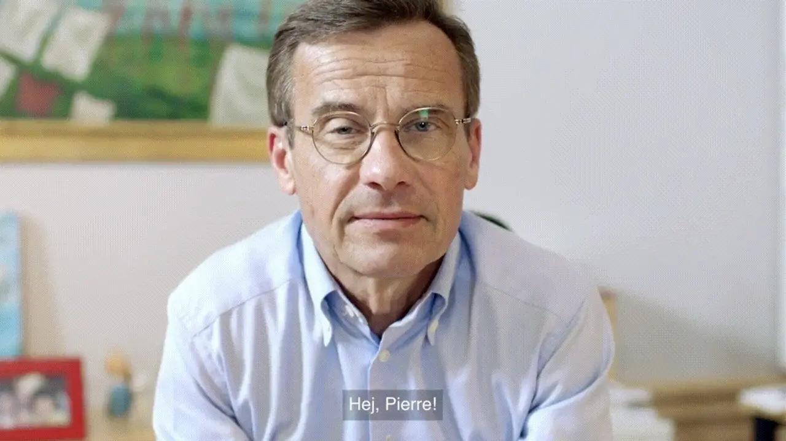
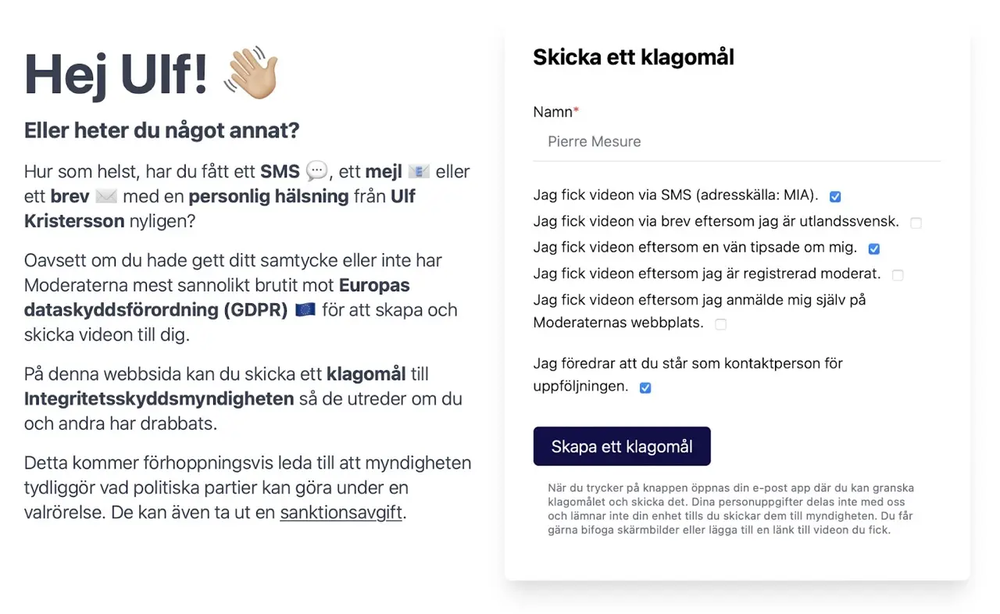


 Original article (webperf.se)


 hejulf.se


 Complaint to IMY


 Source code (website)


 Source code (scraper)


## Hej Pierre

2022 was an election year in Sweden. Political parties were campaigning at national and regional levels and following an ongoing trend, a larger share of the campaign was now digital.

At the beginning of September, I received an e-mail from Ulf Kristersson, then prime minister candidate with the subject "Hej Pierre". It asked me to open a video with a personalised message. The video featured Ulf Kristersson seated at a desk looking at me and reciting some points of his manifesto. But several things caught my attention: Ulf Kristersson was also starting with "Hej Pierre" (which startled me like I guess many others who received this message) and at some point in his speech, Ulf Kristersson pointed to a tablet on his desk where the mayor of my city, Solna, had recorded a message encouraging me to vote for their party locally.

> Freaky, I thought. Why am I receiving this? How does Ulf Kristersson know about me, my name and my address?

## Analysing the ad campaign

So I decided to investigate. I started by exploring the website on which the video message was embedded. I discovered the company behind the ad campaign, the technical method used to stitch video segments together, creating a personalised illusion when most content was identical for everyone. I also managed to algorithmically recreate several hundreds of thousands of unique links corresponding to as many personalised messages that were sent to other people: "Hej Annika", "Hej Waldemar", "Hej Anna". It seemed that Ulf Kristersson had spent half a day recording over 2000 *hälsningar*, and you could even see how the light from the window changed between the snippets.

When I talked about it with friends, I realised some of them had received other personalised variations of the video. All had the same reaction: spooky, and is this even legal?

I gathered a list of GDPR violations from Ulf Kristersson's party (*Moderaterna*) and their technical partners and I discussed it with several specialists. I got valuable feedback and decided to submit a complaint to the Swedish authority for privacy protection (*Integritetsskyddsmyndigheten, IMY*). Unfortunately, it is infamously known for its reluctance to investigate complaints and I knew that my efforts would likely end up in the bin as well.

## Building a counter-campaign

But I also knew that many people got similar video ads (from my investigation, I think they were over 400 000) so I decided to give these people an opportunity to stand behind the complaint.

IMY doesn't accept group complaints so I created a simple website where anyone could send their own complaint with a few clicks (it used to be at hejulf.se but it's now moved to [my domain](https://hejulf.mesu.re)). I also wrote a [blog post on webperf.se](https://webperf.se/articles/hej-ulf/) and I posted everything on Twitter and LinkedIn with a funny video. I waited until after the election night both because I wasn't completely ready before and because I wasn't sure of the reception in the final days of the campaign.



It spread quicker than I imagined and I rapidly got hundreds of messages from people who had also received the message. About 150-250 managed to send a complaint despite some technical issues on my website. I also received a lot of hate messages on Twitter from political supporters on the right.

The story got picked up by specialised media and I got interviewed by [Dagens Media](https://www.dagensmedia.se/medier/digitalt/moderaternas-sms-utskick-massanmals-efter-kampanj-kande-mig-krankt/)/[Resumé](https://www.resume.se/marknadsforing/strategi/moderaternas-sms-utskick-massanmals-efter-kampanj-kande-mig-krankt/).

## What happened since then?

Six months later in March 2023, IMY decided to [start an investigation](https://www.imy.se/nyheter/imy-inleder-tillsyn-av-moderaterna/) (*tillsyn*), which was in itself a victory since they only did it for [less than 5%](https://www.datajurist.se/imy-lyssnar-inte-forsta-gangen/) of the complaints at that time. Most news outlets talked about it but none went into the details of what happened (like [SVT](https://www.svt.se/kultur/myndighet-inleder-tillsyn-mot-moderaternas-videohalsningar), [DN](https://www.dn.se/sverige/myndighet-granskar-moderaternas-valhalsning/), [Aftonbladet](https://www.aftonbladet.se/nyheter/a/zEVjeq/myndighet-granskar-m-efter-valet), [Altinget](https://www.altinget.se/artikel/myndighet-ska-granska-moderaternas-valsatsning)...).

Then, this investigation disappeared in some kind of black hole before IMY finally came to a [decision](https://www.imy.se/tillsyner/moderata-samlingspartiet-riksorganisationen/) at the end of October 2025. On [public radio](https://www.sverigesradio.se/artikel/myndighet-fel-av-m-och-sd-att-skicka-reklam-pa-sms), its author explains that the decision should lead to a change of legal praxis in the way political parties target voters during elections with SMS and e-mails. Consent is now more or less required, especially if the content is adapted to the recipient using personal data.

In my opinion, this is a decision that has far-reaching consequences: the use of contact details from commercial actors buying addresses from Skatteverket, phone numbers from mobile carriers and hiding behind a so-called *utgivningsbevis* is widespread in advertisement. And although IMY is still very reluctant to attack these actors, their clients do not benefit from the same protection (like Moderaterna in this case) and will now hopefully be less willing to use this data without consent.

In politics, I hope that this can be a small brick in a bigger wall that protects voters against disinformation and manipulation. We have seen how very targeted advertisement in the USA in 2016 [could lead to polarisation and manipulation at massive scales](https://en.wikipedia.org/wiki/Project_Alamo) and the recent developments in dark patterns and AI will make it easier in the future. On the other hand, this raises the democratic question of how parties should be able to reach out to voters to inform about their ideas. In response to the EU's attempts to regulate political advertising (DSA and TTPA), most social media platforms [have decided to forbid it altogether](https://opentermsarchive.org/en/publications/political-advertising-after-the-ttpa-exit-adaptation-and-the-future-of-platform-governance/). We need to develop new and better democratic spaces to debate ideas and nurture enlightened citizens.
