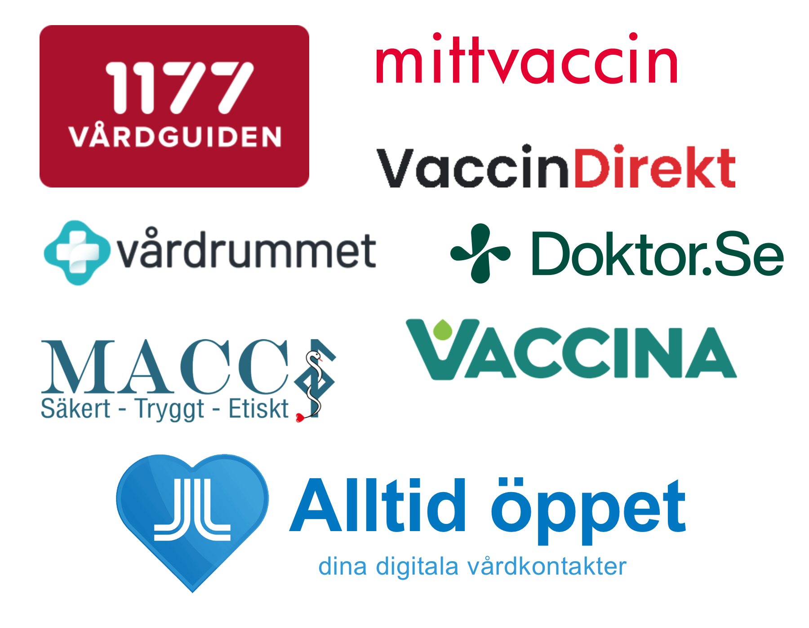
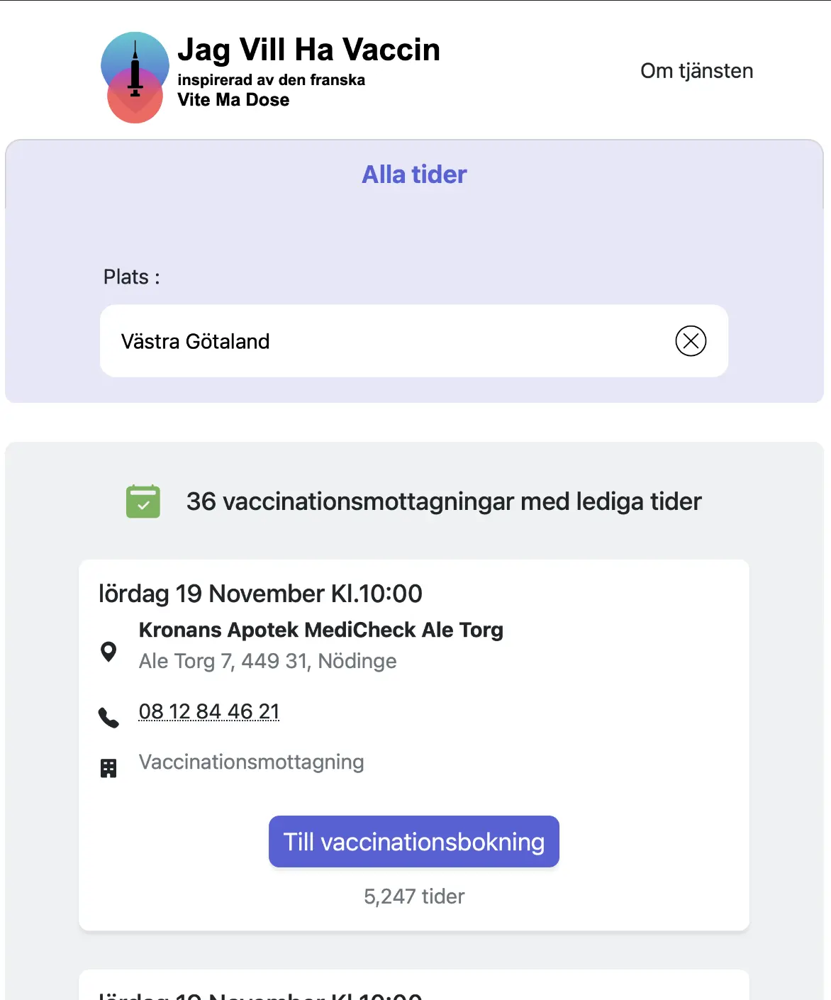

 jagvillhavaccin.nu 
 Källkod (scraper) 
 Källkod (webbsida) 

## Att hitta en vaccintid i Sverige

Precis som andra länder började Sverige vaccinera sin befolkning i början av 2021, med start hos de mest sårbara för att sedan gradvis utöka kampanjen till yngre åldersgrupper. Sveriges sjukvårdssystem är dock regionalt och decentraliserat, med förvånansvärt lite samarbete mellan regionerna. Särskilt de digitala systemen som används i svensk sjukvård kritiseras ofta för sin brist på gemensamma datastandarder och API:er, samt en tendens att antingen uppfinna hjulet på nytt (till stora kostnader) eller hamna i händerna på ineffektiva monopol[^fn:1].

Detta var en dålig grund för en vaccinationskampanj där alla förväntade sig att kunna boka tider online. Resultatet blev otroligt... varierat, även om jag inte kunde ha förutsett riktigt hur kaotiskt det skulle bli när jag först startade projektet.

Några få regioner använde 1177, en robust tjänst vad gäller autentisering och gränssnitt, men som helt saknade ett sätt att få en överblick över tillgängliga tider och platser. Region Stockholm och Region Gotland valde sin app *Alltid Öppet*, en beprövad lösning för andra vårdbokningar. Tyvärr visade appen inte om det fanns tillgängliga tider utan att logga in med BankID. Detta ledde till ett flertal krascher när hundratusentals människor försökte komma åt de fåtal hundra tider som lades ut med jämna mellanrum, vilket i sin tur hindrade patienter som försökte få tillgång till mer kritisk vård[^fn:2]. Det rapporterades också att Region Stockholm tvingades investera flera miljoner kronor i serverkapacitet bara för att möta denna i stort sett misslyckade efterfrågan. En region gav helt upp onlinebokningar och valde att kontakta alla medborgare individuellt per telefon. Slutligen valde de återstående regionerna privata lösningar med förvånansvärt dålig användarupplevelse. I Södermanland var användarna tvungna att manuellt klicka på varje vaccinationscenter för att kontrollera tillgänglighet under veckan, och sedan klicka sig vidare flera gånger för att utforska efterföljande veckor. Den sämsta upplevelsen var för medborgarna i Västra Götaland[^fn:3] och Skåne[^fn:4] [^fn:5], där myndigheterna delegerade bokningen till varje enskilt center. Min Doktor, Din Doktor, Doktor.se... I städer som Göteborg och Malmö var det inte ovanligt att behöva skapa 3–4 olika konton bara för att se de (o)tillgängliga tiderna på de olika centren i sin stadsdel.

I jämförelse hade den danska regeringen på andra sidan Öresund etablerat en enda portal. Precis bredvid inloggningsknappen fanns en tydlig skylt som avrådde användare från att logga in om inga tider fanns tillgängliga.

## Det franska exemplet

I Frankrike var det till en början ännu mer kaotiskt; precis som i de sämsta svenska exemplen hade regeringen delegerat bokningsansvaret till varje vaccinationscenter. Dessa center använde 5–6 olika bokningsplattformar. Även om de visade tillgängliga tider utan att kräva inloggning, var det fortfarande långt ifrån enkelt att navigera.

Frankrike har en stark kultur av "hacktivism", individer som skapar programvara och använder sina färdigheter för det gemensamma bästa. Många lösningar växte fram under pandemin, men en fick otroligt genomslag: [Vite Ma Dose](https://vitemadose.covidtracker.fr). Plattformen, som startades av Guillaume Rozier, syftade till att samla alla vaccinationsbokningar i ett enda, enkelt gränssnitt för hela landet. [Källkoden](https://github.com/CovidTrackerFr/vitemadose) var öppen, och webbplatsen skrapade tillgängliga tider från hundratals vaccinationscenter varje minut.

Snabbt anslöt sig över 100 personer till projektet, underhöll dataflöden och förbättrade webbplatsens sökfunktioner och tillgänglighet. Inom några dagar fanns mobilappar tillgängliga i appbutikerna[^fn:6], och kommunikationsmaterial skapades för att nå ut till alla målgrupper. Trafiken exploderade. När den franska regeringen insåg fördelarna med denna gräsrotslösning beslutade de sig snabbt för att stödja och främja initiativet. Leverantörer av bokningsplattformar satte också upp API:er för att göra det lättare för deras data att återpubliceras, då de såg den nya sajten som en välkommen buffert som avlastade deras egna servrar från de miljontals besök de upplevt i början av kampanjen. Vid årets slut hade över 100 miljoner besökare använt webbplatsen.

Guillaume Rozier tilldelades slutligen den nationella förtjänstorden, där regeringen hyllade hans och andras initiativ för att ha räddat liv och hjälpt miljontals människor[^fn:7].

## Skapandet av "Jag vill ha vaccin!"

Som de flesta fransmän hörde jag talas om detta initiativ när media började skriva om det i början av april 2021. Källkoden var lättförståelig, och jag bestämde mig för att ägna några timmar åt att undersöka om det vore möjligt att återskapa samma tjänst i Sverige. Jag tittade på hur vaccinationsbokningar gjordes tillgängliga i alla regioner och insåg snabbt att många kunde skrapas automatiskt. Ingen tillhandahöll öppna data, men ett skript som simulerade användarbeteende kunde spara informationen i ett strukturerat format. Jag tillbringade en hel helg med att sätta upp en prototyp. Vid slutet hade jag en version baserad på den ursprungliga *Vite Ma Dose*-koden, initialt fortfarande på franska, men som visade svenska vaccinationscenter. Jag översatte snabbt sidan och publicerade den under namnet "Jag vill ha vaccin!" med ett kort inlägg på LinkedIn och Twitter. Det tog fart nästan omedelbart.

## Mottagandet

Trots min begränsade räckvidd på dessa plattformar blev inläggen virala, och över 10 000 personer besökte webbplatsen första dagen. Volontärer hörade av sig för att hjälpa till med korrekturläsning och dataanalys, och flera journalister kontaktade mig[^fn:8] [^fn:9] [^fn:10]. Det var svårt att svara rätt på alla deras frågor, särskilt när de ofta ville skapa ett narrativ att min lilla prototyp var bättre än regionernas oanvändarvänliga lösningar trots deras stora budgetar. Vid den tiden visste jag lite om hur bristfälliga dessa system faktiskt var; jag hade främst startat projektet som ett roligt experiment.

Vad jag inte heller hade förutsett var att dessa samma journalister skulle fråga regionerna varför en enskild individ kunde leverera det de inte kunde. Pressekreterare, ofta utan att förstå tjänsten, avrådde från att använda den[^fn:11], med hänvisning till potentiell datastöld och säkerhetsrisker. Vissa plattformsleverantörer ändrade till och med sina system för att göra det svårare för mig att hämta data. Eftersom ingen av regionerna hörde av sig till mig tog jag själv initiativet till att kontakta dem.

Jag kontaktade varje region och lyckades få till möten med ungefär hälften av dem[^fn:12]. De flesta var bestämda om att jag skulle sluta visa deras vaccintider. Deras resonemang var ofta drivet av rädsla, även om ett giltigt argument var att användare kunde missa obligatorisk information genom att hoppa över de officiella landingssidorna. Jag åtgärdade detta genom att se till att alla användare omdirigerades till de officiella informationssidorna på respektive regions webbplats. En annan oro var den hypotetiska risken att tjänsten skulle sprida virus. *Jag vill ha vaccin!* spårade inte användare och samlade inte in någon personlig information, men regionerna ville inte lita på en extern aktör. Jag föreslog att de skulle återanvända källkoden och drifta den själva, men kulturen kring öppen källkod är tyvärr svag i den svenska offentliga sektorn, och ingen region tackade ja till erbjudandet[^fn:13].

Jag minns tydligt ett möte med Daniel Forsberg, då ledande politiker för Region Stockholm (numera lobbyist). Jag föreslog att visa deras vaccintider på *Jag vill ha vaccin!* för att avlasta den tunga trafiken i appen Alltid öppet. Han upprepade gång på gång hur "innovationsvänlig" han var och hur mycket regionen värderade öppna data, men förklarade att i just detta fall, tyvärr, inte var välkommet[^fn:12].

En enda region välkomnade samarbetet: Västra Götaland. Regionledningen hade insett den katastrofala situation de befann sig i, där över 15 privata leverantörer visade tider på sina egna plattformar, vilket gjorde det svårare för medborgare att boka och för dem att få en tydlig överblick över vaccinationskampanjen. Ett litet team, inklusive Marcus Österberg (skaparen av [webperf.se](https://webperf.se)), fick i uppdrag att bygga en officiell samlingssida. Som en stark förespråkare för internetstandarder och öppenhet publicerade Marcus snabbt regionens data öppet[^fn:14].

Detta gjorde det möjligt för mig att samla fler vaccintider i tjänsten. Ironiskt nog visade *Jag vill ha vaccin!* fler tider i VGR än regionens officiella plattform, eftersom deras team var tvunget att be om data från privata leverantörer[^fn:15]. Jag skrapade utan att be om lov, då jag visste att offentlighetsprincipen och allmänintresset var på min sida.

## Slutet

Tyvärr fick projektet aldrig det institutionella stöd jag hade hoppats på. Trots folkligt stöd och mediebevakning kunde jag bara samla ungefär hälften av landets vaccintider, och flera regioner insisterade på att jag skulle stänga ner tjänsten. Jag blev till och med personligen hotad med polisanmälan av chefen för en vårdcentral.

Även om jag aldrig stängde ner webbplatsen[^fn:16] [^fn:17] [^fn:18], minskade antalet besökare gradvis efter den initiala toppen. *Jag vill ha vaccin!* blev så småningom irrelevant när majoriteten av befolkningen hade fått sin första dos och brist inte längre var ett problem.

När journalister hörde av sig var de ofta i jakt på kritiska citat för att bygga ett polariserat narrativ. Jag förklarade att hela historiken över vaccintider som samlats in av sajten fanns tillgänglig som öppna data och kunde användas för att analysera effektiviteten i utrullningen. Jag använde den själv för att rapportera om center med hundratals lediga tider medan andra i samma region inte hade några alls. Tyvärr krävde denna typ av analys mer tid än de flesta journalister var villiga att investera, så data förblir mestadels oanvända än idag (om du är forskare, kontakta mig gärna. Jag har arkiverat dem 😉).

## Sensmoral

Till skillnad från sin franska motsvarighet, och till min initiala besvikelse, blev *Jag vill ha vaccin!* aldrig en riktig succé. Men succé var aldrig det primära målet, och detta projekt lärde mig mycket. Inte bara tekniskt utan också om utmaningarna med att innovera inom den svenska offentliga sektorn.

## Referenser

[^fn:1]: [Detta gick snett med Millennium i VGR (lakartidningen.se)](https://lakartidningen.se/nyheter/externa-granskningen-detta-gick-snett-med-millennium-i-vgr/)
[^fn:2]: [Alltid öppet var inte alltid öppet (dn.se)](https://www.dn.se/sverige/alltid-oppet-var-inte-alltid-oppen-darfor-kraschade-appen/)
[^fn:3]: [Svårt boka vaccintid när spärren lyftes: ”Det fungerar inte” (molndalsposten.se)](https://www.molndalsposten.se/nyheter/svart-boka-vaccintid-nar-sparren-lyftes-det-fungerar-inte.f68bd423-3165-4599-9bf1-839d6290ec03)
[^fn:4]: [Vaccinationernas fas 4 började med kaos (sydsvenskan.se)](https://www.sydsvenskan.se/skane/vaccinationernas-fas-4-borjade-med-kaos-sedan-tog-tiderna-snabbt-slut/)
[^fn:5]: [Vaccinstrulet tvingar regionen annonsera för att fylla tiderna (sydsvenskan.se)](https://www.sydsvenskan.se/naringsliv/thomas-frostberg-vaccinstrulet-tvingar-regionen-annonsera-for-att-fylla-tiderna/)
[^fn:6]: [Vite Ma Dose tops the App Store rankings (på franska, leparisien.fr)](https://www.leparisien.fr/high-tech/la-vaccination-elargie-et-le-pass-sanitaire-dopent-les-telechargements-de-vitemadose-et-tousanticovid-21-05-2021-3H7Y6E2FCNHWXC264ZM6DRUE5Q.php)
[^fn:7]: [Guillaume Rozier får förtjänstorden (på franska, 20minutes.fr)](https://www.20minutes.fr/societe/3046971-20210522-guillaume-rozier-createur-vitemadose-recoit-ordre-national-merite)
[^fn:8]: [Nystartad privatsajt visar tusentals svenska vaccintider (svd.se)](https://www.svd.se/a/561W4E/privatsajt-visar-tusentals-svenska-vaccintider)
[^fn:9]: [Pierre skapade sajten som är lösningen på vaccin-kaoset (emanuelkarlsten.se)](https://emanuelkarlsten.se/pierre-skapade-sajten-som-ar-losningen-pa-vaccin-kaoset-sa-hittar-du-lediga-tider-i-din-region/)
[^fn:10]: [Han listar lediga vaccintider (svt.se)](https://www.svt.se/nyheter/inrikes/han-listar-lediga-vaccintider)
[^fn:11]: [Regionens uppmaning: Använd inte nya bokningssidan (svt.se)](https://www.svt.se/nyheter/lokalt/blekinge/regionen-avrader-anvandning-av-ny-bokningssida)
[^fn:12]: Presentationer från mina möten med regionerna finns tillgängliga [här](https://github.com/PierreMesure/pierre.mesu.re/tree/master/static/jagvillhavaccin/presentations)
[^fn:13]: [Regionen inte så intresserade av nya sajten för att boka vaccin: ”Vår egen fungerar ganska bra” (smp.se)](https://www.smp.se/vaxjo/regionen-inte-sa-intresserade-av-nya-sajten-for-att-boka-vaccin-var-egen-fungerar-ganska-bra/)
[^fn:14]: [Hjälp VGR testa vårt API med öppna vaccintider (vgrblogg.se)](https://vgrblogg.se/utveckling/2021/05/27/hjalp-vgr-testa-vart-api-med-oppna-vaccintider/)
[^fn:15]: [Sidan skulle samla lediga tider - ännu saknas manga (arkiverad)](https://github.com/PierreMesure/pierre.mesu.re/tree/master/static/jagvillhavaccin)
[^fn:16]: [Egenutvecklad vaccinationssajt igång igen: Listar många lediga tider (nyteknik.se)](https://www.nyteknik.se/nyheter/egenutvecklad-vaccinationssajt-igang-igen-listar-manga-lediga-tider/352149)
[^fn:17]: [Regionerna motarbetade sajten som ville effektivisera vaccinbokning – nu är den tillbaka dubbelt så stor (emanuelkarlsten.se)](https://emanuelkarlsten.se/regionerna-motarbetade-sajten-som-ville-effektivisera-vaccinbokning-nu-ar-den-tillbaka-dubbelt-sa-stor/)
[^fn:18]: ['It's a democratic tool': The site that helps you find a Covid vaccine slot in Sweden (thelocal.se)](https://www.thelocal.se/20210615/its-a-democratic-tool-the-site-that-helps-you-find-a-covid-vaccine-slot-in-sweden)
