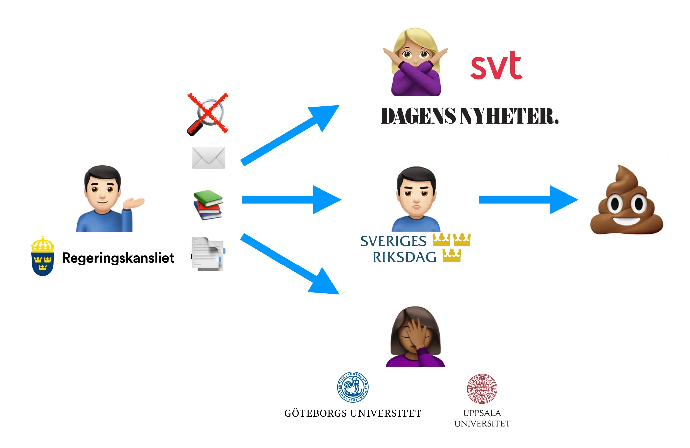


 Källkod


## Vad är en "remiss"?

Remissprocessen är ett kritiskt steg i den svenska lagstiftningsprocessen. Innan Regeringskansliet utformar en proposition och skickar den till Riksdagen beställer de en eller flera statliga utredningar (SOU) som ligger till grund för arbetet. När de är klara skickas de ut för en offentlig remissrunda.

Denna process kritiseras ibland för att vara långsam eller för att tillfrågade myndigheter inte alltid talar klarspråk eller agerar självständigt. Regeringen har också anklagats för att ignorera inkomna synpunkter eller hoppa över remissrundan helt. Enligt mig är de främsta problemen bristen på insyn och att processen till stor del är anpassad för lobbyverksamhet från särintressen och organiserat civilsamhälle, vilket gör att röster och åsikter från en stor del av befolkningen, särskilt marginaliserade grupper, förbises.

För att öppna upp denna process skapade jag *Din Riksdag* och utformade ett system för gemensamt skrivna namninsamlingar kallade *medborgarremissvar*. Jag behövde dock tillgång till alla befintliga remissvar, vilket ledde till skapandet av OpenRemiss.

## Bara PDF:er på en gammaldags webbplats

Trots många förfrågningar från andra myndigheter, journalister och forskare vägrar Regeringskansliet att tillhandahålla uppgifterna på sin webbplats som öppna data. När det gäller remissprocessen ser det ut såhär:

- Listan över pågående remisser måste skrapas från HTML-sidor, tillsammans med metadata om de relaterade utredningarna.
- Listan över filer för varje specifik process kräver också HTML-skrapning.
- Remisslistan, alltså vilka organisationer som bjudits in att svara, publiceras som en PDF-fil. Dessutom använder varje departement sin egen mall för den, så standardiserad extrahering är inte lätt. Organisationer listas bara med namn, med en förvånande mängd stavfel och variationer.
- Remissvaren själva är också PDF-filer, det format som regeringen begär in. Varje organisation använder sin egen mall, vilket gör det svårt att extrahera innehållet utan att förlora formatering eller sammanhang.
- Svar som skickas in av organisationer som inte fanns med på den ursprungliga remisslistan publiceras inte ens. Dessa måste begäras ut enligt offentlighetsprincipen och lämnas bara ut som fysiska papperskopior mot en avgift.
- På samma sätt är regeringens egen remissammanställning inte offentlig, även om en kort sammanfattning vanligtvis ingår i slutet av den efterföljande propositionen.

**OpenRemiss** är ett skript utformat för att automatiskt ladda ner denna information (förutom de två sista punkterna) och konvertera den till strukturerade format som lämpar sig för analys, forskning och innovativa tjänster. Det laddar ner listor över remisser med deras metadata, hämtar filerna för varje process och konverterar remisslistor till strukturerade listor samtidigt som det städar upp organisationsnamn.

Intressant nog ledde detta projekt till mitt nuvarande jobb på datalabbet hos [Statskontoret](https://www.statskontoret.se). Jag kom i kontakt med dem medan de byggde *Hitta remissvar* och en liknande scraper för att samla in nödvändig data. Gränssnittet som byggdes före min tid där visar tydligt potentialen i öppna, strukturerade remissdata, liksom efterföljande projekt vi har gjort tillsammans med forskare och Regeringskansliet.

Sedan dess har jag också byggt [g0vse](../g0vse), en scraper som kan hämta all information från regeringen.se, även om den inte hanterar remisslistor eller namnrensning.

Tveka inte att höra av dig om du är intresserad av att använda koden eller data från detta projekt! Jag hjälper gärna till att komma igång och samarbetar gärna för att göra dessa data mer tillgängliga.
