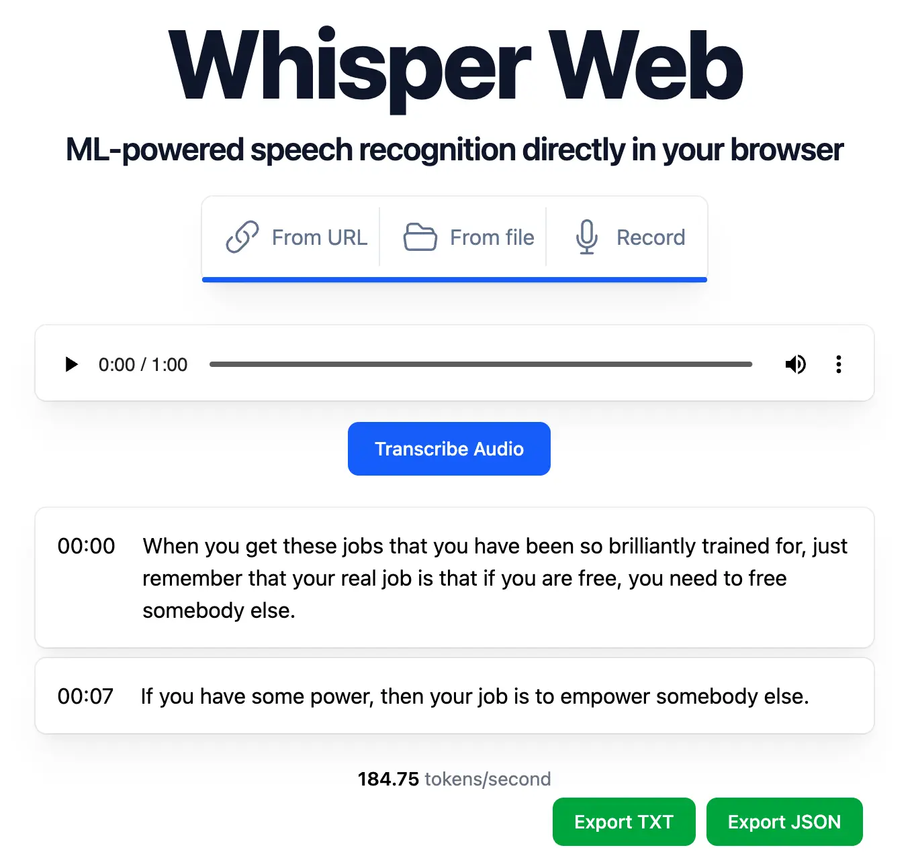

 whisper-web.mesu.re 
 Source code 

On Valentine's day of 2025, the Swedish National library's AI lab (KB-labb) released their own fine-tuned version of OpenAI's Whisper models. They retrained the models using thousands of hours of audio from both SVT (the Swedish public service) and parliament debates. Unfortunately, to avoid legal issues and to stay focused on their mission, the lab only provides the [open weights of the models](https://huggingface.co/KBLab/kb-whisper-large).

So I took a few hours to build a web interface to use the models as simply as possible. I called it Whisper-Web.

The first time you give it a file, it will download an open AI model and perform the transcription locally in your browser. This means that your audio file never leaves your device. It also means that the transcription will be slow or fail if your computer/smartphone is not powerful enough to perform it.

In the settings, you can pick among different models and various quantisation levels. A smaller model with a lower quantisation will be faster but make more mistakes. By default, Whisper-web uses small models but you can try a bigger one and see if it works on your device.

In the app, the user can choose between the Swedish models, Norwegian ones (from the [Norwegian national library](https://huggingface.co/collections/NbAiLab/nb-whisper)) and OpenAI's models that are the best in all other languages.

This project's code is actually a fork of a demo created by Xenova that I updated and improved. Both are available on Github. Feel free to reuse or contribute to it.
